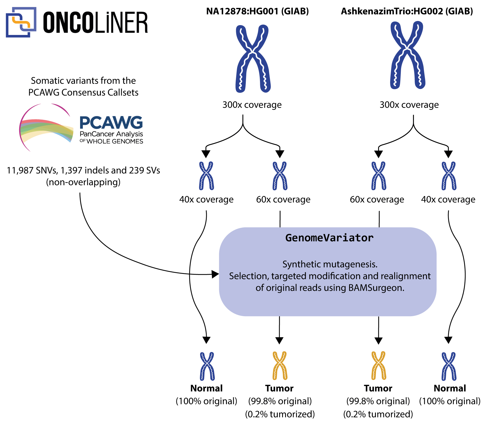

# GenomeVariator<!-- omit in toc -->

[](https://zenodo.org/doi/10.5281/zenodo.12755117)

R. Martín et al., “ONCOLINER: A new solution for monitoring, improving, and harmonizing somatic variant calling across genomic oncology centers,” _Cell Genomics_, vol. 4, no. 9. Elsevier BV, p. 100639, Sep. 2024. [doi: 10.1016/j.xgen.2024.100639](https://doi.org/10.1016/j.xgen.2024.100639)

GenomeVariator is a tool for adding genomic variants to an existing genome (in SAM/BAM/CRAM format). Currently supported variants are SNVs, indels and SVs (insertions, deletions, translocations, inversions and duplications). It generates realistic genomes as almost always less than 99% of the original real genome is modified. The variants must be provided in a VCF compatible format (VCF/BCF/VCF.GZ). The tool is written in Python and uses [BAMSurgeon](https://github.com/adamewing/bamsurgeon) under the hood to generate the tumorized genomes.

The limited availability of real validated datasets for variant calling benchmarking makes this exercise difficult. This is why tumorized genomes are currently complementing these real datasets. Tumorized genomes ensure the data protection of patients, because they are not identifiable, and thus remove the need for bureaucratic processes that slow down progress in the field of cancer research. Furthermore, tumorized genomes enable researchers to have absolute control over the features and variants they contain.

GenomeVariator is framed under EUCANCan’s (EUropean-CANadian Cancer network) second work package and is used to complement the benchmarking datasets of ONCOLINER. The generation workflow is provided as a standalone Python script with a command-line interface and is optimized for running in a multi-core environment, more precisely in a single node of MareNostrum 4.



## Table of contents<!-- omit in toc -->
- [Installation](#installation)
  - [Singularity](#singularity)
  - [Docker](#docker)
- [Usage](#usage)
  - [Interface](#interface)
- [Authors](#authors)
- [License](#license)


## Installation
### Singularity
We recommend using [`singularity-ce`](https://github.com/sylabs/singularity) with a version higher than 3.9.0. You can download the Singularity container using the following command (does not require root privileges):

```
singularity pull genome-variator.sif docker://ghcr.io/computational-genomics-bsc/genomevariator:latest
```

If you want to build the container yourself, you can use the [`singularity.def`](singularity.def) file (requires root privileges):
```
git clone --recurse-submodules --remote-submodules https://github.com/Computational-Genomics-BSC/GenomeVariator
sudo singularity build --force genome-variator.sif singularity.def
```

### Docker
You can download the Docker image using the following command:
```
docker pull ghcr.io/computational-genomics-bsc/genomevariator:latest
```

You can build the Docker container with the following command (requires root privileges):

```
git clone --recurse-submodules --remote-submodules https://github.com/Computational-Genomics-BSC/GenomeVariator
docker build -t genome-variator .
```


## Usage

The process of generating an tumorized genome with genomic variants from an existing human genome solely consists in adding the genomic variants to the alignment file of an existing genome. This requires the use of the [`AlignmentSplitter`](#alignmentsplitter) and [`Tumorizer`](#tumorizer) scripts.


First, split the input file into two files (_Normal_ and _Normal 2_ samples) using `AlignmentSplitter`. Assuming you have a singularity image called `genome-variator.sif`, following is an example of how to divide an 300X input CRAM file into two 30X CRAM files in a 16-core and 32 GiB RAM machine:
```
singularity exec genome-variator.sif python3 -O /GenomeVariator/src/alignment_splitter.py -i in_300X.cram -ic 300 -o splitted_ -oc 30 -sc 2 -p 16 -s 0

mv splitted_0_30X_0 normal_30X.cram
mv splitted_0_30X_1 normal_2_30X.cram
```

Finally, add the variants to the second normal CRAM file using the `Tumorizer`:
```
singularity exec genome-variator.sif python3 -O /GenomeVariator/src/tumorizer/main.py -i normal_2_30X.cram -o tumor.cram -f ref.fa -v variants.vcf --vaf 0.5 -td results_tmp -p 16 -mm 32 -s 0
```
### Interface

#### AlignmentSplitter<!-- omit in toc -->
```
usage: alignment_splitter.py [-h] -i INPUT [-f FASTA] -ic INPUT_COVERAGE -o
                             OUTPUT -oc OUTPUT_COVERAGES
                             [OUTPUT_COVERAGES ...] [-sc SAMPLE_COUNT]
                             [-p MAX_PROCESSES] [-s SEED]

optional arguments:
  -h, --help            show this help message and exit
  -i INPUT, --input INPUT
                        Input alignment file
  -f FASTA, --fasta FASTA
                        Reference fasta file (required for CRAM files)
  -ic INPUT_COVERAGE, --input-coverage INPUT_COVERAGE
                        Input file coverage
  -o OUTPUT, --output OUTPUT
                        Output prefix
  -oc OUTPUT_COVERAGES [OUTPUT_COVERAGES ...], --output-coverages OUTPUT_COVERAGES [OUTPUT_COVERAGES ...]
                        Output coverages
  -sc SAMPLE_COUNT, --sample-count SAMPLE_COUNT
                        Number of samples to generate for each output coverage
  -p MAX_PROCESSES, --max-processes MAX_PROCESSES
                        Number of max processes
  -s SEED, --seed SEED  Random seed
```

#### Tumorizer<!-- omit in toc -->
```
usage: main.py [-h] -f FASTA_REF -v VCF_FILE -i INPUT_ALIGNMENT -o
               OUTPUT_ALIGNMENT [--vaf VAF] [--donor DONOR] [-td TMP_DIR]
               [-tds TMP_DIR_SIZE] [-p PROCESSES] [-mm MAX_MEMORY] [-s SEED]

optional arguments:
  -h, --help            show this help message and exit
  -f FASTA_REF, --fasta-ref FASTA_REF
                        Reference FASTA file
  -v VCF_FILE, --vcf-file VCF_FILE
                        VCF file with variants. Each variant can have a VAF
                        field in the INFO column so that the VAF can be
                        different for each variant. If the VAF field is not
                        present, the default VAF is used.
  -i INPUT_ALIGNMENT, --input-alignment INPUT_ALIGNMENT
                        Input alignment file (SAM/BAM/CRAM)
  -o OUTPUT_ALIGNMENT, --output-alignment OUTPUT_ALIGNMENT
                        Output alignment file (SAM/BAM/CRAM)
  --vaf VAF             Default variant allele frequency (0.0-1.0). Default is
                        0.5
  --donor DONOR         Extra donor alignment file (for large duplications)
  -td TMP_DIR, --tmp-dir TMP_DIR
                        Directory where temporal files are stored
  -tds TMP_DIR_SIZE, --tmp-dir-size TMP_DIR_SIZE
                        Maximum size of temporal directory (in GB)
  -p PROCESSES, --processes PROCESSES
                        Maximum number of processes
  -mm MAX_MEMORY, --max-memory MAX_MEMORY
                        Maximum memory usage (in GB)
  -s SEED, --seed SEED  Random seed
```

## Authors

* **Rodrigo Martín** - *Code and Scientific Methodology* - [ORCID](https://orcid.org/0000-0002-2128-1329) [GitHub](https://github.com/Rapsssito)
* **David Torrents** - *Scientific Methodology* - [ORCID](https://orcid.org/0000-0002-6086-9037)

## License

This project is licensed under the BSC Dual License - see the [LICENSE](LICENSE.md) file for details.
