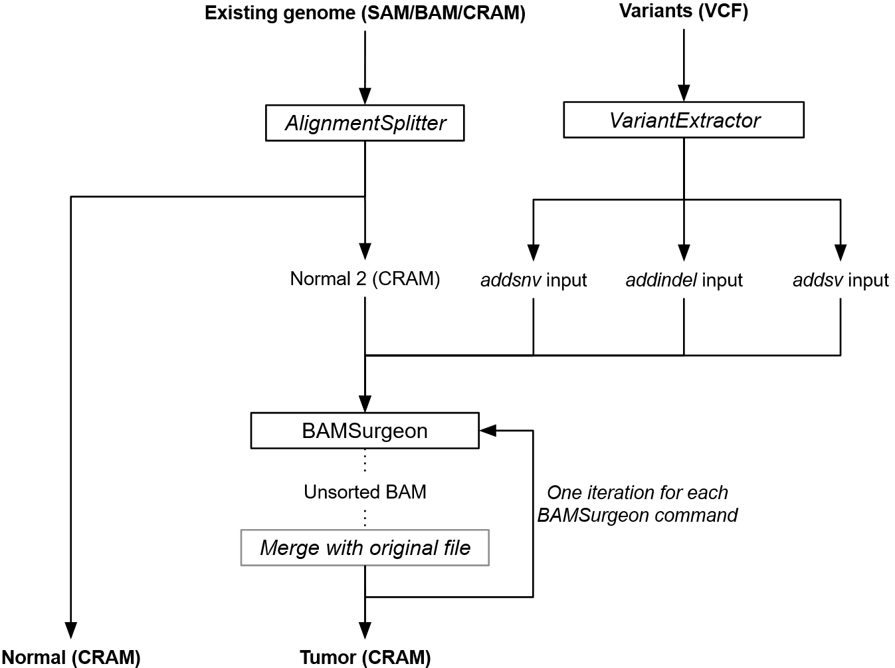

# GenomeVariator<!-- omit in toc -->

GenomeVariator is a tool for adding genomic variants to an existing genome (in SAM/BAM/CRAM format). Currently supported variants are SNVs, indels and SVs (insertions, deletions, translocations, inversions and duplications). It generates realistic genomes as almost always less than 99% of the original real genome is modified. The variants must be provided in a VCF compatible format (VCF/BCF/VCF.GZ). The tool is written in Python and uses [BAMSurgeon](https://github.com/adamewing/bamsurgeon) under the hood to generate the tumorized genomes.

The limited availability of real validated datasets for variant calling benchmarking makes this exercise difficult. This is why tumorized genomes are currently complementing these real datasets. Tumorized genomes ensure the data protection of patients, because they are not identifiable, and thus remove the need for bureaucratic processes that slow down progress in the field of cancer research. Furthermore, tumorized genomes enable researchers to have absolute control over the features and variants they contain.

GenomeVariator is framed under EUCANCan’s (EUropean-CANadian Cancer network) second work package and is used to complement the benchmarking datasets of EUCANCan’s genomic variant calling benchmarking/recommendation platform. The generation workflow is provided as a standalone Python script with a command-line interface and is optimized for running in a HPC environment, more precisely in MareNostrum 4.

## Table of contents<!-- omit in toc -->
- [Getting started](#getting-started)
- [Usage](#usage)
- [Scripts](#scripts)
  - [Tumorizer](#tumorizer)
    - [Dependencies](#dependencies)
  - [AlignmentSplitter](#alignmentsplitter)
    - [Dependencies](#dependencies-1)
- [Authors](#authors)
- [License](#license)


## Getting started

You can build the docker image with the following command:

```bash
docker build -t tumorizer-generator .
```


## Usage

The process of generating an tumorized genome with genomic variants from an existing human genome solely consists in adding the genomic variants to the alignment file of an existing genome. This requires the use of the [AlignmentSplitter](#alignmentsplitter) and [Tumorizer](#tumorizer) scripts.



First, split the input file into two files (_Normal_ and _Normal 2_ samples) using AlignmentSplitter. Following is an example of how to divide an 300X input CRAM file into two 30X CRAM files in a 16-core machine:
```
python3 -O src/alignment_splitter.py -i in.cram -ic 300 -o splitted_ -oc 30 -sc 2 -t 16 -s 0

mv splitted_0_30X_0 normal_30X.cram
mv splitted_0_30X_1 normal_2_30X.cram
```

Finally, add the variants to the second normal CRAM file using the Tumorizer in a 16-core machine:
```
python3 -O src/tumorizer/main.py -i normal_2_30X.cram -o tumor.cram -f ref.fa -v variants.vcf --vaf 0.5 -td results_tmp -p 16 -mm 32 -s 0
```

## Scripts
### Tumorizer
Its source code can be found in the [src/tumorizer](src/tumorizer) directory.

#### Dependencies
* [SAMtools](http://www.htslib.org/)
* [Pysam](https://github.com/pysam-developers/pysam) >= 0.19.0
* BAMSurgeon's [dependencies](https://github.com/adamewing/bamsurgeon#dependencies)

### AlignmentSplitter
Its source code can be found in the [src/alignment_splitter](src/alignment_splitter) file.

#### Dependencies
* [Pysam](https://github.com/pysam-developers/pysam) >= 0.19.0

## Authors

* **Rodrigo Martín** - *Code and Scientific Methodology* - [ORCID](https://orcid.org/0000-0002-6086-9037) [GitHub](https://github.com/Rapsssito)
* **Romina Royo** - *Scientific Methodology* - [ORCID](https://orcid.org/0000-0003-3493-0874)
* **Montserrat Puiggròs** - *Scientific Methodology* - [ORCID](https://orcid.org/0000-0001-5034-7924)
* **David Torrents** - *Scientific Methodology* - [ORCID](https://orcid.org/0000-0002-6086-9037)

## License

This project is licensed under the BSC Dual License - see the [LICENSE](LICENSE.md) file for details.
